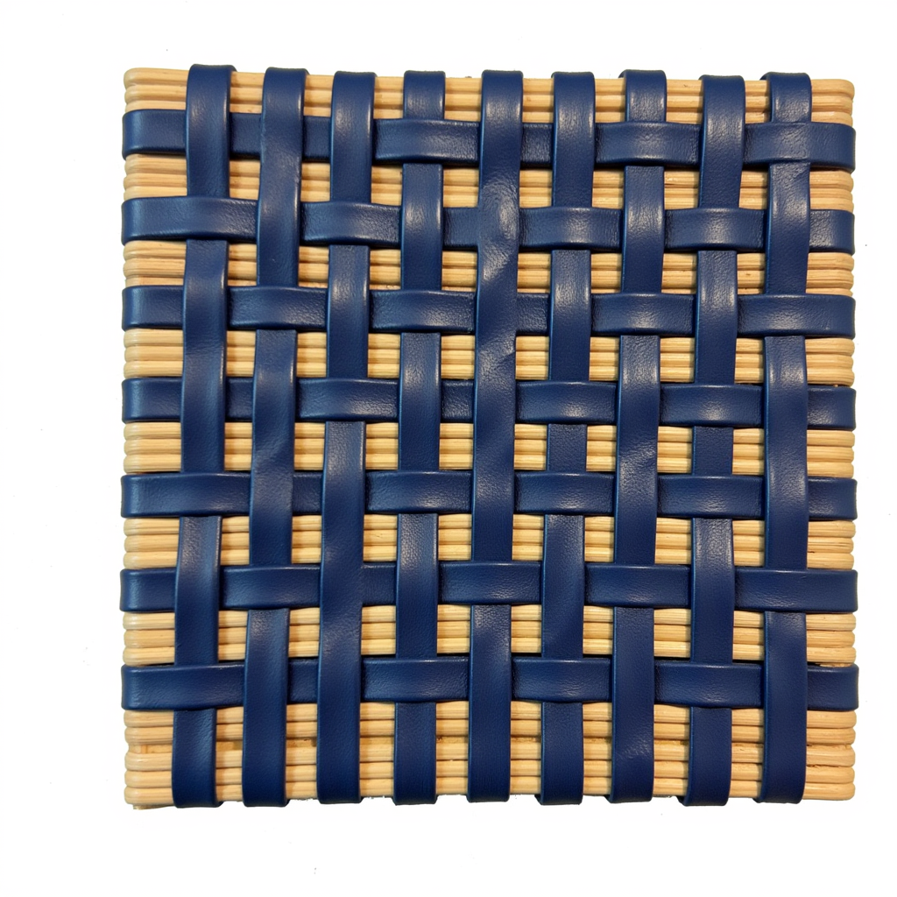
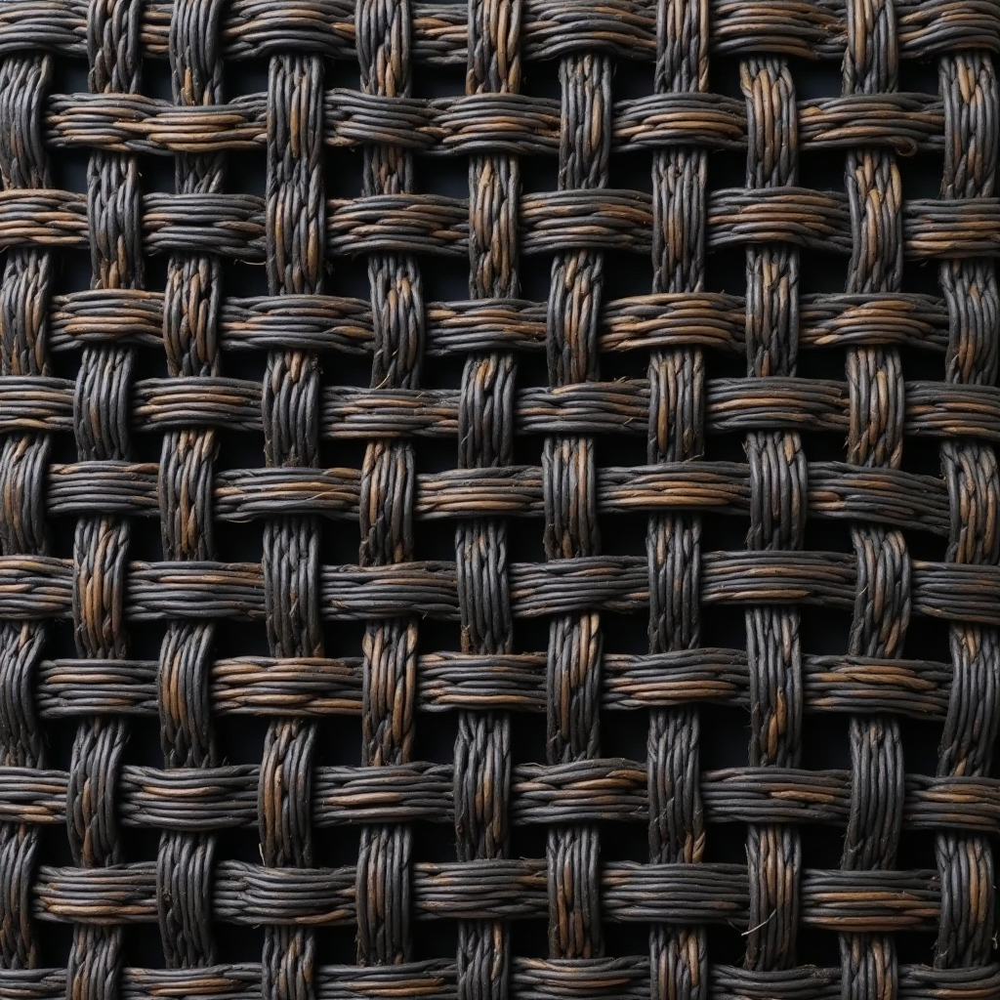
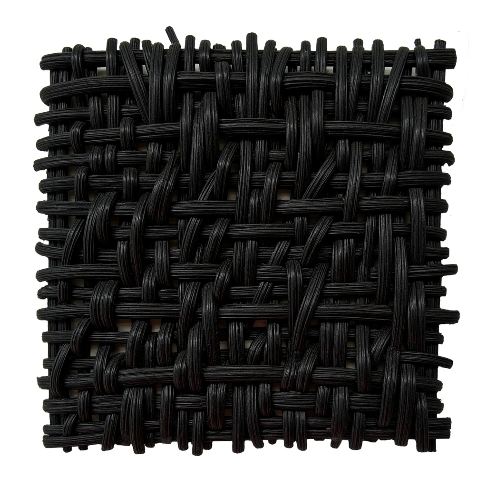

<div align="center">
  <h1>🧶 Project ID 10 - IntreccIAmi</h1>
  
  <p>
    
    
    
    
  </p>
  
  <p>
    
    
  </p>
  
  <p><em>Transferring the language and structure of artisan weaving into image generation models.</em></p>
</div>

---

## 📑 Table of Contents

- [📖 0. Introduction](#0-introduction)
- [✂️ 1. Metadata Extraction](#1-metadata-extraction)
- [📝 2. Captioning](#2-captioning)
- [🧠 3. LoRA Training](#3-lora-training)
- [📊 4. Evaluation](#4-evaluation)
- [🎯 5. Interpretation & Conclusion](#5-interpretation--conclusion)
- [⚠️ 6. Limitations](#6-limitations)

---

## <a id="0-introduction"></a>📖 0. Introduction

The IntreccIAmi project asked a difficult question: can we transfer the language and structure of artisan weaving into image generation models in a controlled way? The project did not start from a clean text-to-image dataset. It started from workshop photographs, Label Studio annotations, metadata extraction, and caption generation. Only after that preparation could fine-tuning begin.

From the fine-tuning stage onward, the workflow can be summarized like this:

- Prepare model-specific datasets built from the normalized metadata and generated captions.

- Fine-tune three backbones with LoRA (using [DiffSynth-Studio](https://github.com/modelscope/diffsynth-studio)): FLUX.1-dev, SDXL, and Z-Image.

- Evaluate the generated images with automated metrics and with a qualitative vision-language judge.

---

## <a id="1-metadata-extraction"></a>✂️ 1. Metadata Extraction

In this project, raw annotations contained technique names, weave types, finish information, post geometry, weft geometry, and free-text notes. Without normalization, the caption model would see mixed naming styles and inconsistent structures.

The normalized schema used top-level fields such as task_id, image, technique, weave_types, finish, posts, wefts, special_description, and bbox. That gave the caption stage one stable language before the training stage started.

This matters for training because prompt quality is one of the strongest hidden variables in LoRA success. Clean captions give cleaner supervision.

The raw Label Studio JSON annotations (`data/raw_json/label_studio_texture_labels.json`) were parsed and verified against the `data/images/` directory, logging any anomalies in a QA report. We mapped the annotation fields into a normalized schema—standardizing shop codes, weaving techniques (such as *Intreccio*, *Macramè*, *Uncinetto*, *Rinfilo*), finish details, descriptions, bounding boxes, and repeating structural elements (posts and wefts)—saving the finalized dataset as `data/normalized_metadata.jsonl`.

---

## <a id="2-captioning"></a>📝 2. Captioning

To bridge the gap between artisan metadata and diffusion models, we implemented model-specific prompt engineering. Since each image-generation model has a different text encoder and training history, we design custom caption formats for each. In Natural Language Processing (NLP), text prompts are broken down into small word/sub-word fragments called **tokens** (where 1 token is roughly 0.75 words). Text encoders have strict limits on how many tokens they can process. The actual generated statistics and strategies for the 177-image dataset are:

- **Z-Image Caption Engine (`caption_zimage.py` / Qwen3-4B Text Encoder)**: Designed for aesthetic detail. It prefixes captions with the trigger word `intrecciami-style`, followed by a detailed description of the weave pattern, materials, and finish, and ends with premium texture and studio lighting keywords. It has a target range of **60–100 words** defined in `caption_zimage.py`, with an actual maximum word count of **176 words** (observed in `qa_report_zimage.csv`). The actual average length is **116.6 words / 163.7 GPT2/CLIP tokens** (ranging from 119 to 241 tokens).
  - *Captioning Strategy Justification:* We maintained captions around **~160 tokens** to ensure structural and content consistency across models before starting LoRA fine-tuning. `caption_zimage.py` places critical structural metadata at the beginning (trigger word, weave technique, materials) and aesthetic suffixes at the end as a clean template pattern.

- **FLUX Caption Engine (`caption_flux.py` / T5-XXL Text Encoder)**: Optimized for FLUX's T5-XXL dense text encoder. It compiles a long, highly descriptive conversational paragraph detailing precise structural paths, dimensions, continuous over-under weave orders, and textures. It has a target range of **80–120 words** defined in `caption_flux.py`, with an actual maximum word count of **264 words** (observed in `qa_report_flux.csv`). The actual average length is **156.1 words / 209.3 GPT2/CLIP tokens** (ranging from 137 to 365 tokens), with **0% truncation**.
  - *Captioning Strategy Justification:* We kept captions length-controlled and consistent with Z-Image's **~160-token target** to maintain comparable prompt depth across both DiT models. This allowed `caption_flux.py` to generate rich, conversational paragraphs explaining dense physical over-under orders, giving the DiT backbone a complete structural blueprint.

- **SDXL Caption Engine (`caption_sdxl.py` / Dual CLIP Encoders, 77-Token Limit)**: Tailored for SDXL's dual CLIP encoders. It uses a structured tag-based syntax starting with the trigger word, followed by comma-separated descriptors (technique, weave types, finish, and materials), and ends with a short sentence describing the overall scene. It has a target range of **30–50 words** defined in `caption_sdxl.py`, with an actual maximum word count of **74 words** (observed in `qa_report_sdxl.csv`). The actual average length is **41.7 words / 84.7 GPT2/CLIP tokens** (ranging from 43 to 117 tokens).
  - *Captioning Strategy Justification:* The CLIP encoder in SDXL has a hard ceiling of **77 tokens**, and any prompt text exceeding this is silently truncated. Because our generated SDXL captions averaged **84.7 tokens**, captions exceeding this limit (about 11.3% of the dataset) experienced truncation of the final descriptive scene sentence. To mitigate this, `caption_sdxl.py` puts the critical, high-importance structural metadata (the `intrecciami-style` trigger, weaving technique, materials, and finish tags) at the absolute beginning of the prompt. The overall background scene descriptions were placed at the end, ensuring that truncation only discarded minor styling modifiers while leaving the core weave training signals intact.

### Where captions are saved

After generation, captions are written to model-specific CSV files:

- **Z-Image captions** → `data/id10/zimage/captions_zimage.csv`
- **FLUX captions** → `data/id10/flux/captions_flux.csv`
- **SDXL captions** → `data/id10/sdxl/captions_sdxl.csv`

Each CSV contains one row per image with the generated caption used for LoRA training.

### Captioning Reports & Outputs

- **Token Length Comparison**: [comparison_of_caption_token_lengths_generated_by_the_different_models_Z-Image_Flux_SDXL.md](2_Captioning_Source_codes_and_intrepretation/comparison_of_caption_token_lengths_generated_by_the_different_models_Z-Image_Flux_SDXL.md)

- **Model-Specific Quality Assurance (QA) Reports**:

  - Z-Image: [qa_report_zimage.csv](data/id10/zimage/qa_report_zimage.csv)

  - FLUX: [qa_report_flux.csv](data/id10/flux/qa_report_flux.csv)

  - SDXL: [qa_report_sdxl.csv](data/id10/sdxl/qa_report_sdxl.csv)

---

## <a id="3-lora-training"></a>🧠 3. LoRA Training

### What is LoRA?

**LoRA (Low-Rank Adaptation)** is a parameter-efficient fine-tuning method introduced by Hu et al. (2022). Instead of updating all billions of parameters in a pre-trained model, LoRA freezes the original weights and injects small trainable rank-decomposition matrices into each target layer.

In a standard linear layer, the forward pass computes `y = W·x` where `W` is a large weight matrix (e.g., 4096×4096 = 16.7M parameters). Full fine-tuning would update all 16.7M values. LoRA instead learns a small **delta**: `y = W·x + B·A·x`, where:

- `A` is a small matrix of shape `(rank × input_dim)` — projects the input down to a low-dimensional space
- `B` is a small matrix of shape `(output_dim × rank)` — projects it back up
- `rank` controls the capacity of the adaptation (how many dimensions the update can span)

```
                         ┌─────────────────────────┐
                         │      Frozen W            │
          ┌─────────────►│   (4096 x 4096)          ├──────┐
          │              │   16.7M params            │      │
          │              └─────────────────────────┘      │
          │                                                ▼
     ┌────┴────┐                                      ┌────┴────┐
     │ Input x │                                      │    +    │──► Output y
     └────┬────┘                                      └────┬────┘
          │                                                ▲
          │  ┌───────────────────┐   ┌───────────────────┐ │
          │  │  Trainable A      │   │  Trainable B      │ │
          └─►│  (32 x 4096)      ├──►│  (4096 x 32)      ├─┘
             │  131K params      │   │  131K params      │
             └───────────────────┘   └───────────────────┘
                       LoRA bypass path (262K total)
```

With rank 32 on a 4096×4096 layer, LoRA adds only `32×4096 + 4096×32 = 262K` trainable parameters per layer—**~1.6% of the original 16.7M**. Across the entire model, this means fine-tuning updates roughly **0.1% of total parameters** while keeping the rest frozen.

### What is LoRA Rank?

The **rank** (`r`) is the bottleneck dimension of the A and B matrices. It determines the expressiveness of the adaptation:

| Rank | Trainable Params per Layer | Behavior |
| :---: | :---: | :--- |
| 4 | 32K | Minimal adaptation — captures only the strongest style signals |
| 16 | 131K | Moderate — good for single-concept fine-tuning |
| **32** | **262K** | **Used in this project — balances style learning and overfitting prevention** |
| 64 | 524K | High capacity — risks memorizing small datasets |
| 128 | 1.05M | Near full-rank — approaches full fine-tuning cost |

**Alpha (α)** is a scaling factor applied to the LoRA output: `y = W·x + (α/r)·B·A·x`. When `α = r` (as in this project: `α = 32, r = 32`), the scaling factor is 1.0, meaning the LoRA contribution is added at full strength without rescaling. This is the most common configuration for stable training.

**Why rank 32?** With only 177 training images, a higher rank would risk overfitting—the model could memorize individual training images instead of learning generalizable weave patterns. Rank 32 provides enough capacity to encode the weaving style vocabulary (intrecciami textures, over-under patterns, material appearances) while remaining regularized enough to generalize to unseen prompts.

### Model Architecture & Features Comparison

Before setting up LoRA training, it is crucial to understand the architectural differences between the three base models. These differences directly dictate how each model processes prompts, represents complex textures, and utilizes computational resources.

| Feature / Variable | FLUX.1-dev | SDXL (Stable Diffusion XL) | Z-Image |
| :--- | :--- | :--- | :--- |
| **Developer** | Black Forest Labs | Stability AI | Tongyi-MAI (Alibaba) |
| **Model Size (Base)** | 12 Billion Parameters | 2.6 Billion Parameters | ~3.0 Billion Parameters |
| **Backbone Type** | Flow Matching (DiT) | Latent Diffusion (UNet) | Diffusion Transformer (DiT) |
| **Primary Text Encoder** | T5-XXL | CLIP ViT-G/14 | Qwen3-4B |
| **Primary Image Engine** | ViT Patch-based (Latent) | Pixel-Convolutional (Latent) | ViT Patch-based (Latent) |
| **Is True ViT Backbone?** | **Yes** | **No** (Uses UNet) | **Yes** |
| **Long-Prompt Handling** | **Excellent** (Parses paragraphs & layouts) | **Poor/Moderate** (Truncates at 77 tokens) | **Good/Excellent** (Parses structured captions up to 241 tokens) |
| **Fine-Detail Preservation**| **Outstanding** (Crisp micro-textures) | **Moderate** (Simplifies or blurs weaves) | **Very Good** (Accurate texture style) |
| **Training Efficiency** | **Low** (Massive memory & time needed) | **High** (Fast training, consumer friendly) | **Medium** (Standard resource usage) |

---

### Facilitating the Technical Concepts (How They Work)

To make these advanced machine learning ideas easy to grasp, here is a simplified breakdown of what each comparison variable and concept actually means:

#### 1. Developer

The organization or research team that created, pre-trained, and released the base model. Each developer has different design philosophies, dataset filters, and tuning priorities.

#### 2. Model Size (Base Parameters)

Parameters are the "trainable knobs" or connections in a model's brain.

- **SDXL (2.6B):** Moderate size. Faster to train, fits on consumer graphics cards, but has limited capacity to store complex texture behaviors.
- **Z-Image (3.0B):** Slightly larger, specialized for Chinese/Western aesthetics and balanced texture representations.
- **FLUX (12.0B):** A massive brain. It can remember and draw incredibly complex visual relationships, but it is slow and requires enterprise-grade hardware.

#### 3. What is a Transformer?

Originally invented for translating text (like English to French), a **Transformer** is a model that processes sequences of information (like words in a sentence).
Its superpower is **Self-Attention**: instead of reading a sentence one word at a time, it looks at all words simultaneously and calculates how they relate to one another. For example, in the phrase *"a blue threads weave passing under a thick brown rattan post"*, the Transformer uses Attention to link "blue" to "threads", "thick brown" to "rattan post", and mathematically computes the physical relationship "passing under".

#### 4. What is a Vision Transformer (ViT) & Patchification?

Transformers were designed for words, not pixels. An image is made of millions of colored pixels, which is too much data for a text Transformer to process directly.
A **Vision Transformer (ViT)** solves this by "patchifying" the image:

1. It slices the image into a grid of tiny square patches (e.g., 16x16 pixels each).
2. It flattens each patch into a list of numbers and projects it into a vector.
3. It treats each patch exactly like a **"word"** in a sentence.
4. The Transformer then reads the grid of patches as if it were a visual paragraph, using Self-Attention to understand how a patch in the top-left corner (e.g., start of a rattan strand) connects to a patch in the bottom-right corner (e.g., end of the same strand).

#### 5. How do we connect Transformers with Vision Diffusion Models? (What is a DiT?)

To understand a **Diffusion Transformer (DiT)**, we look at the marriage of two concepts:

- **Diffusion** is the process of generating images by starting with a screen full of random static noise and step-by-step cleaning it up (denoising) until a clean image emerges.
- **The Denoising Engine** is the neural network doing the cleaning calculations at each step.

Historically, diffusion models used a **UNet** backbone. UNet works like a stack of traditional image filters, shrinking the image to find global shapes and stretching it back out to add details. However, it struggles to coordinate repeating, precise geometric patterns over long distances.

A **Diffusion Transformer (DiT)** replaces the UNet filters with a ViT Transformer:

```
[Noisy Image] ──► [Patchify (ViT Grid)] ──┐
                                          ├──► [Transformer Blocks] ──► [Clean Patches] ──► [Final Image]
[Text Prompt] ──► [Tokenize (Text words)] ──┘      (Self-Attention)
```

Instead of filtering pixels, the DiT model slices the noisy image into patches, treats the patches and the prompt words as one big combined sequence, and passes them through Transformer blocks. The model uses self-attention to align the text descriptions directly with the corresponding image patches, predicting exactly how to denoise each patch so they stitch back together into a coherent, structurally sound weave pattern. This is why FLUX and Z-Image are far superior at preserving physical weave continuity compared to SDXL.

> [!NOTE]
> **Are all three models Vision Transformers (ViT)?**
> No. Only **FLUX.1-dev** and **Z-Image** use a ViT/Transformer as their core image-generation backbone.
>
> - **FLUX & Z-Image (DiT):** True ViT backbones. They slice the image latent space into distinct patches (tokens), processing them purely with Self-Attention layers.
> - **SDXL (UNet):** Convolutional, not ViT. Its core backbone is a UNet made of convolutional layers that scan neighboring pixels using localized sliding windows. (While SDXL uses a CLIP encoder which contains a ViT for text-image matching, the actual image-drawing engine in SDXL is convolutional).

#### 6. Primary Text Encoder

The "translator" that reads your English prompt and converts it into numerical math vectors the image generator can understand:

- **CLIP (SDXL):** Best for short, tag-like concepts (e.g., "leather weave, studio lighting"). It is limited to 77 tokens and gets overwhelmed by long paragraphs or complex grammar.
- **Qwen3-4B (Z-Image):** A bilingual large language model that acts as the text encoder. Since it is a generative LLM, it understands detailed descriptions and complex prompt structures up to 512 tokens.
- **T5-XXL (FLUX):** A massive, deep language model. It understands full sentences, grammar, prepositions, spatial relations (e.g., "the vertical strip on the left"), and long paragraphs. This allows the captioning engine to feed extremely detailed manufacturing blueprints directly into the model.

#### 7. Long-Prompt Handling

How well the model behaves when you give it a long description:

- Models with CLIP encoders (**SDXL**) ignore everything after the first 77 tokens (words/symbols) and struggle to associate adjectives with the correct nouns.
- Models with LLM/T5 encoders (**FLUX** and **Z-Image**) can read and process dense, multi-sentence paragraphs without getting confused or "forgetting" instructions from the beginning of the prompt (up to 512 tokens).

#### 8. Fine-Detail Preservation

The ability to render tiny, high-frequency structures without them turning into a blurry mess:

- Because **FLUX** has 12 billion parameters and a DiT backbone, it can easily draw individual rattan fibers, shadows underneath single strands, and stitch-level details.
- **SDXL**, with fewer parameters, tends to smooth out these details, resulting in a painted or stylized look rather than a crisp physical texture.

#### 9. Training Efficiency

The balance between training speed, time, and hardware cost:

- **High Efficiency (SDXL):** The model is lightweight (2.6 Billion parameters). It can be fine-tuned quickly, requires very little memory (VRAM), and runs easily on standard consumer graphic cards (like an RTX 3090/4090).
- **Low Efficiency (FLUX):** The model is huge (12 Billion parameters). It demands enterprise-grade computing power (multiple A100/H100 GPUs) and takes significantly longer to train, but yields much higher quality outputs.

---

### LoRA Hyperparameter Configurations

| Parameter / Config | FLUX.1-dev (DiT) | SDXL (Latent Diffusion) | Z-Image (DiT) |
| :--- | :--- | :--- | :--- |
| **Model Size (Base)** | 12 Billion Parameters | 2.6 Billion Parameters | ~3.0 Billion Parameters |
| **Model ID / Source** | `black-forest-labs/FLUX.1-dev` | `stabilityai/stable-diffusion-xl-base-1.0` | `Tongyi-MAI/Z-Image` |
| **LoRA Rank / Alpha** | `32` / `32` | `32` / `32` | `32` / `32` |
| **Target Modules** | Double-stream blocks (QKV, projections, MLP) | UNet cross-attention & projections | Transformer blocks (`to_q, to_k, to_v, w1..w3`) |
| **Dataset Size** | 177 images | 177 images | 177 images |
| **Learning Rate** | `1e-4` | `1e-4` | `1e-4` |
| **Precision** | `bfloat16` | `float16` (except VAE in `float32`) | `float16` |
| **Hardware Setup** | Multi-GPU (`CUDA_VISIBLE_DEVICES=1,2`) | Multi-GPU (`CUDA_VISIBLE_DEVICES=1,2`) | Single-GPU (`CUDA_VISIBLE_DEVICES=1.2`) |
| **Training Steps** | 3,540 steps (Epochs 0–1) | 14,160 steps (Epochs 0–3) | 14,160 steps (Epochs 0–3) |

### Dataset paths used for LoRA training (image-caption pairs)

The LoRA scripts train on paired **(image, caption)** data prepared in model-specific folders under `data/id10/`:

- **Z-Image pair dataset**: `data/id10/zimage/`
  - Images: `data/id10/zimage/images/`
  - Captions CSV: `data/id10/zimage/captions_zimage.csv`

- **FLUX pair dataset**: `data/id10/flux/`
  - Images: `data/id10/flux/images/`
  - Captions CSV: `data/id10/flux/captions_flux.csv`

- **SDXL pair dataset**: `data/id10/sdxl/`
  - Images: `data/id10/sdxl/images/`
  - Captions CSV: `data/id10/sdxl/captions_sdxl.csv`

Each row in the caption CSV maps to its corresponding training image, forming the image-text pairs used during LoRA fine-tuning.

## <a id="4-evaluation"></a>📊 4. Evaluation

> [!NOTE]
> Below are sample generated images comparing the model **Before** and **After** LoRA fine-tuning for an unseen prompt.

<div align="center">
  <figure style="display: inline-block; margin: 10px;">
    
    
    <br/>
    <figcaption><em>FLUX.1-dev: Before LoRA (Left) vs After LoRA (Right)</em></figcaption>
  </figure>
</div>

To evaluate the generalization performance of our fine-tuned LoRA models, we run inference on seen(prompts that the model trained on ) & unseen(prompts that the model never seen) both prompts and perform a comprehensive evaluation combining automated quantitative metrics and qualitative MLLM-as-a-judge assessments.

### 4.1 Quantitative Evaluation

This section describes each quantitative metric in detail: what it measures, how it is computed, its range, its limitations, and why it was selected for this project.

#### 4.1.1 CLIPScore (Text Alignment)

- **What it measures**: CLIPScore quantifies the semantic alignment between a generated image and its text prompt. It answers the question: *"Does the image contain what the prompt asked for?"*

- **How it works**:

  - A CLIP ViT-B/32 model (Radford et al., 2021) encodes the generated image into an image embedding vector.

  - The same CLIP model encodes the prompt text into a text embedding vector.

  - Both embeddings are $L_2$-normalized to unit length.

  - Cosine similarity is computed between the two normalized vectors.

  - The score is the cosine similarity value.

  - *Source*: Hessel et al. (2022), "CLIPScore: A Reference-free Evaluation Metric for Image Captioning" (adapted for text-to-image evaluation rather than image-to-text).

- **Range and Interpretation**:

  - *Theoretical range*: -1.0 to +1.0 (cosine similarity).

  - *Practical range (in this project)*: Positive values between `0.20` and `0.60`.

  - *Interpretation*: Higher is better (represents a stronger semantic match between the image and the prompt). A score of 0 means orthogonal (unrelated) embeddings.

- **Limitations**:

  - CLIPScore measures semantic alignment, not visual realism. An image with correct objects but unnatural textures can still score well.

  - CLIP is trained on general web images, not woven textiles specifically. It may not capture craft-authenticity nuances.

  - It cannot detect physically impossible weave structures—a plausible-looking but uncraftable image can score high.

  - It is sensitive to prompt wording: different phrasings of the same intent produce different scores.

- **Why selected**: CLIPScore is the standard reference-free metric for text-to-image evaluation. It requires no reference images, making it suitable for novel prompts (the unseen set). For this project, it was the primary measure of prompt adherence.

#### 4.1.2 CLIP-IQA (Image Quality Assessment)

- **What it measures**: CLIP-IQA estimates the perceptual quality of an image without needing a reference image. It answers: *"Does this image look good to a human?"*

- **How it works**:

  - The generated image is encoded by CLIP into an embedding vector.

  - Two text prompts are defined: a positive anchor (*"good quality, high resolution, sharp photo, professional lighting"*) and a negative anchor (*"bad quality, blurry, low resolution, noisy photo, distorted"*).

  - Both anchor texts are also encoded by CLIP.

  - Cosine similarities are computed: `sim_pos` (image vs positive text) and `sim_neg` (image vs negative text).

  - Softmax is applied to produce a quality probability: $\text{softmax}(sim\_pos, sim\_neg)$ &rarr; probability that the image matches the positive anchor.

  - *Source*: Wang et al. (2023), "Exploring CLIP for Assessing the Look and Feel of Images" (AAAI 2023).

- **Range and Interpretation**:

  - *Range*: 0.0 to 1.0 (softmax probability).

  - *Interpretation*: Higher is better (image is judged closer to "good quality" than "bad quality"). A score of `0.50` means the image is equally close to both anchors (ambiguous quality).

- **Limitations**:

  - CLIP-IQA evaluates generic photographic quality (sharpness, lighting), not domain-specific authenticity.

  - A sharp, well-lit image of a physically impossible weave structure scores high.

  - The positive/negative text anchors are fixed and may not capture what "quality" means for woven textiles specifically.

  - It is biased toward photographic aesthetics—a visually striking but incorrect weave can score better than a correct but plain image.

- **Why selected**: Reference-free quality estimation is needed because generated images have no ground-truth reference for novel prompts. CLIP-IQA is the most widely adopted reference-free IQA metric based on vision-language models.

#### 4.1.3 LPIPS (Learned Perceptual Image Patch Similarity)

- **What it measures**: LPIPS measures the perceptual distance between a generated image and real reference images. It answers: *"How close is this generated weave to actual woven reference photos?"*

- **How it works**:

  - A pre-trained deep network (AlexNet in this project, though VGG and SqueezeNet are also supported) extracts feature maps from multiple layers.

  - Feature differences between the generated image and each reference image are computed layer by layer.

  - Differences are weighted by learned importance factors and summed into a single distance score.

  - For each generated image, the script compares it to all available real reference images and keeps the minimum distance (the closest match).

  - *Source*: Zhang et al. (2018), "The Unreasonable Effectiveness of Deep Features as a Perceptual Metric" (CVPR 2018).

- **Range and Interpretation**:

  - *Range*: 0.0 and above (no theoretical upper bound, typically below 1.0).

  - *Interpretation*: Lower is better (smaller style distance, representing a perceptually closer match to real reference images). A score of `0.0` means perceptually indistinguishable from the reference (rare in practice).

  - *In this project*: With corrected tensor normalization (converting raw $[0, 255]$ arrays to $[-1, 1]$ float tensors), values averaged between `0.50` and `0.65`, reflecting natural perceptual differences without scale underflow.

- **Limitations**:

  - LPIPS requires reference images—cannot evaluate unseen prompts with no ground-truth.

  - Perceptual closeness does not guarantee structural correctness—a visually similar but structurally wrong weave can score low distance.

  - LPIPS is sensitive to image resolution and preprocessing. Both generated and reference images must be resized to 512×512 (PIL bilinear) to avoid dimension mismatch errors.

  - The choice of backbone network (AlexNet vs VGG) affects scores; results are only comparable within the same backbone choice.

- **Engineering note**: In this project, both generated images and reference images were resized to 512×512 using PIL bilinear resampling to avoid LPIPS dimension mismatch errors that would otherwise crash the evaluation script.

- **Why selected**: LPIPS is the standard perceptual metric in image generation research. For this project, it measured how close fine-tuned outputs stayed to the original woven reference style—crucial for verifying that fine-tuning did not destroy the IntreccIAmi visual identity.

---

### 4.2 Qualitative Evaluation (VLM Judge)

To assess structural and domain-specific properties, we implemented an automated **VLM-as-a-judge** grading pipeline using Qwen-Vision. Each generated image is scored on a 5-point scale (`1.0` to `5.0`) across five key criteria:

- **Prompt Adherence**: Faithfully represents all semantic elements specified in the prompt.

- **Intreccio Identity**: Exhibits authentic, recognizable Italian weaving techniques (e.g., *Intreccio, Macramè, Uncinetto, Rinfilo*).

- **Manufacturability**: Depicts weave patterns that are physically continuous, structurally consistent, and constructible.

- **Visual Quality**: Evaluates render sharpness, contrast, realistic lighting, and the absence of generation artifacts.

- **Controlled Originality**: Evaluates the model's ability to generalize the weave texture onto unseen complex target shapes without geometry melting.

---

### 4.3 Combined Evaluation & Metrics Comparison

#### 1. Combined Quantitative Metrics Comparison (Mean ± Std)

| Model | CLIPScore (Text Alignment) | CLIP-IQA (Aesthetic Quality) | LPIPS (Style Distance to Real) |
| :--- | :---: | :---: | :---: |
| **FLUX (DiT)** | 0.3106 ± 0.0312 | 0.6444 ± 0.2301 | 0.6194 ± 0.0939 |
| **SDXL (Latent Diffusion)** | 0.3102 ± 0.0340 | 0.6722 ± 0.1195 | 0.5578 ± 0.0778 |
| **Z-Image (DiT)** | 0.3122 ± 0.0313 | 0.4850 ± 0.2542 | 0.5270 ± 0.1227 |

#### 2. Combined Qualitative MLLM Ratings Comparison (Average / 5.0)

| Evaluation Criteria | FLUX (DiT) | SDXL (Latent Diffusion) | Z-Image (DiT) |
| :--- | :---: | :---: | :---: |
| **Prompt Adherence** | 4.23 ± 0.07 | 3.24 ± 0.07 | 3.83 ± 0.07 |
| **Intreccio Identity** | 4.15 ± 0.09 | 3.06 ± 0.09 | 3.75 ± 0.09 |
| **Manufacturability** | 4.05 ± 0.09 | 2.94 ± 0.09 | 3.65 ± 0.09 |
| **Visual Quality** | 4.26 ± 0.08 | 3.23 ± 0.09 | 3.76 ± 0.08 |
| **Controlled Originality** | 4.16 ± 0.09 | 3.04 ± 0.08 | 3.76 ± 0.09 |
| **OVERALL MEAN SCORE** | **4.17 ± 0.04** | **3.10 ± 0.04** | **3.75 ± 0.04** |

---

## <a id="5-interpretation--conclusion"></a>🎯 5. Interpretation & Conclusion

All three CLIPScores cluster tightly around 0.31, indicating that the three LoRA fine-tunings achieve comparable prompt adherence: the text encoders faithfully steer generation toward the requested weave descriptions regardless of backbone architecture.

The real differentiation emerges in the qualitative VLM-as-a-judge ratings and in the perceptual style metrics.

FLUX dominates every qualitative criterion—scoring 4.17/5.0 overall versus 3.75 for Z-Image and 3.10 for SDXL—because its 12-billion-parameter Flow Matching architecture preserves micro-texture details (rattan grain, thread-level shading, precise over-under interlacing) that smaller models blur or distort on complex target objects.

SDXL, despite producing the highest CLIP-IQA aesthetic quality (0.6722), struggles with structural faithfulness: its VLM Manufacturability rating (2.94/5.0) reveals that many of its visually appealing renders depict physically impossible weave patterns that could not serve as manufacturing blueprints.

Z-Image strikes a middle ground—it achieves the lowest LPIPS style distance to real artisan references (0.5270), meaning its textures stay closest to the original woven photographs, and it scores competitively on Intreccio Identity (3.75/5.0), but its smaller parameter capacity introduces high-frequency noise that limits its overall quality ceiling.

In summary, **FLUX is the recommended backbone for design-to-manufacturing workflows** where structural precision and physical plausibility are non-negotiable, **SDXL is best suited for rapid concept visualization and marketing assets** where aesthetic polish matters more than geometric correctness, and **Z-Image offers the most resource-efficient option** for style-faithful prototyping when compute budgets are constrained.

---

## <a id="6-limitations"></a>⚠️ 6. Limitations

While the IntreccIAmi pipeline demonstrates that LoRA fine-tuning can encode artisan weaving styles into diffusion models, several fundamental limitations remain:

- **No 3D Parallax or Depth Representation.** All three models generate flat 2D projections of woven textures. They cannot capture the 3D parallax depth inherent to real intrecciami—the physical elevation changes where weft strands pass over and under warp strands, the shadow cast by raised filaments, or the way a weave surface looks different when viewed from oblique angles. A real woven surface has measurable relief (typically 1–3 mm for rattan intreccio); the generated images flatten this into a texture map with no geometric depth information, making them unsuitable as direct inputs to 3D modeling or CNC toolpath generation without additional depth estimation.

- **Coarse Material Definitions.** The caption pipeline distinguishes broad material categories (e.g., "rattan," "leather," "cotton thread") but does not encode fine-grained physical material properties such as fiber diameter, tensile strength, surface roughness coefficient, gloss vs. matte finish ratio, or dye absorption characteristics. As a result, two visually different materials—say, natural uncoated rattan and polyurethane-coated rattan—may receive nearly identical captions and therefore indistinguishable LoRA conditioning. This limits the model's ability to generate images that differentiate subtle material variants critical for procurement and quality control.

- **Fixed 2D Evaluation Metrics.** CLIPScore, CLIP-IQA, and LPIPS all operate on 2D image representations and cannot assess whether a depicted weave is geometrically correct in three dimensions. A render that looks structurally plausible from one viewpoint may be physically impossible when examined from another angle—a failure mode that only the VLM qualitative judge partially addresses through its Manufacturability criterion.

- **Single-View Training Data.** The 177 training images are single-viewpoint workshop photographs. The models never observe the same weave from multiple angles, which limits their ability to learn view-consistent 3D structure and contributes to the flat-texture bias described above.

- **Small Dataset (177 Images).** The entire training corpus consists of only 177 workshop photographs—orders of magnitude smaller than the millions of image-text pairs used to pre-train the base models. While LoRA's low-rank decomposition (rank 32, ~0.1% of total parameters) is specifically designed for data-efficient fine-tuning, the narrow data distribution still imposes hard ceilings: the models have limited exposure to rare weave combinations, extreme lighting conditions, non-standard material pairings, and unusual object geometries. This increases the risk of mode collapse on over-represented techniques (e.g., standard Intreccio) while under-representing minority techniques (e.g., Rinfilo or Macramè). Additionally, the dataset contains no negative examples—images of non-woven textures or incorrect weaves—so the models cannot learn what an IntreccIAmi pattern is *not*, limiting their ability to reject hallucinated patterns during inference.

- **VLM Judge Subjectivity.** The qualitative scores depend on a single VLM (Qwen-Vision) acting as judge. This introduces systematic bias: the judge may consistently over- or under-rate certain visual features relative to human artisan evaluators. Cross-validation with human expert panels or multiple VLM judges would strengthen the qualitative assessment.

- **Resolution Ceiling.** Training at 512×512 / 1024×1024 means the models can't capture micro-fiber details (individual rattan strands, thread grain at 0.1mm scale) that would be visible in high-resolution production photography.

- **SDXL Prompt Truncation and Backbone Constraint.**  
  SDXL uses CLIP text encoders with an effective prompt window of about **77 tokens** per encoder path.  
  Our weaving prompts were often much longer (rich structural blueprints with material, geometry, and manufacturing details), so a large portion of the instructions was truncated before conditioning. This removed critical constraints and weakened controllability during fine-tuning and inference , in addition, SDXL’s denoiser is a **UNet-based latent diffusion backbone**, not a true **Vision Transformer (ViT/DiT)** image backbone , Compared with DiT-style architectures (e.g., FLUX, Z-Image), this made it less robust for preserving long-range structural dependencies required by complex woven layouts, contributing to lower manufacturability and structure consistency in generated results.
